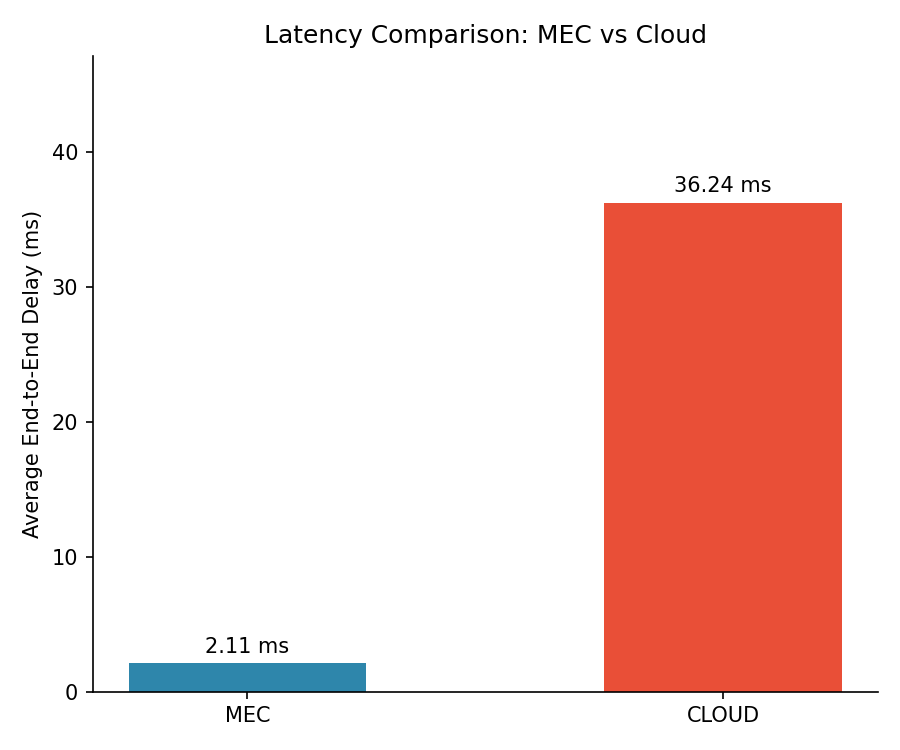
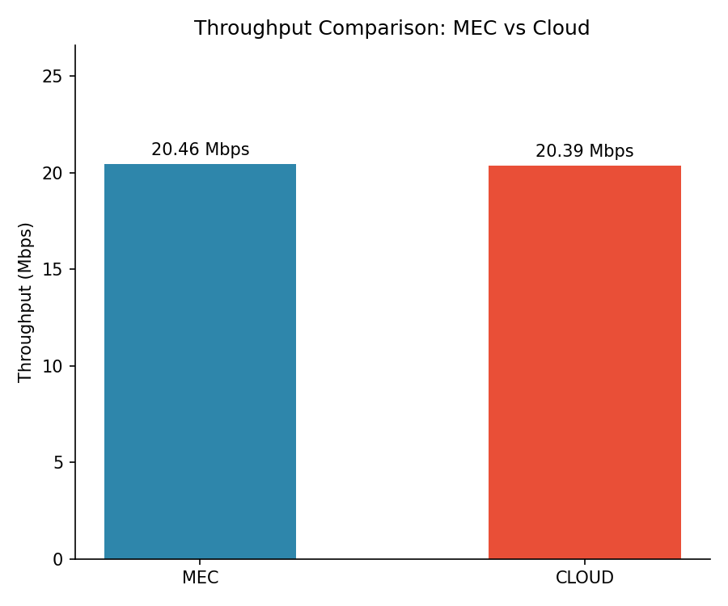
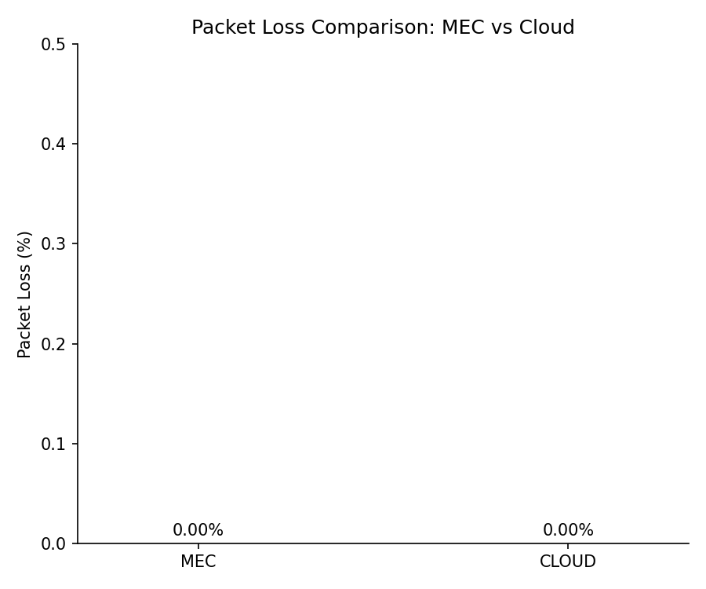
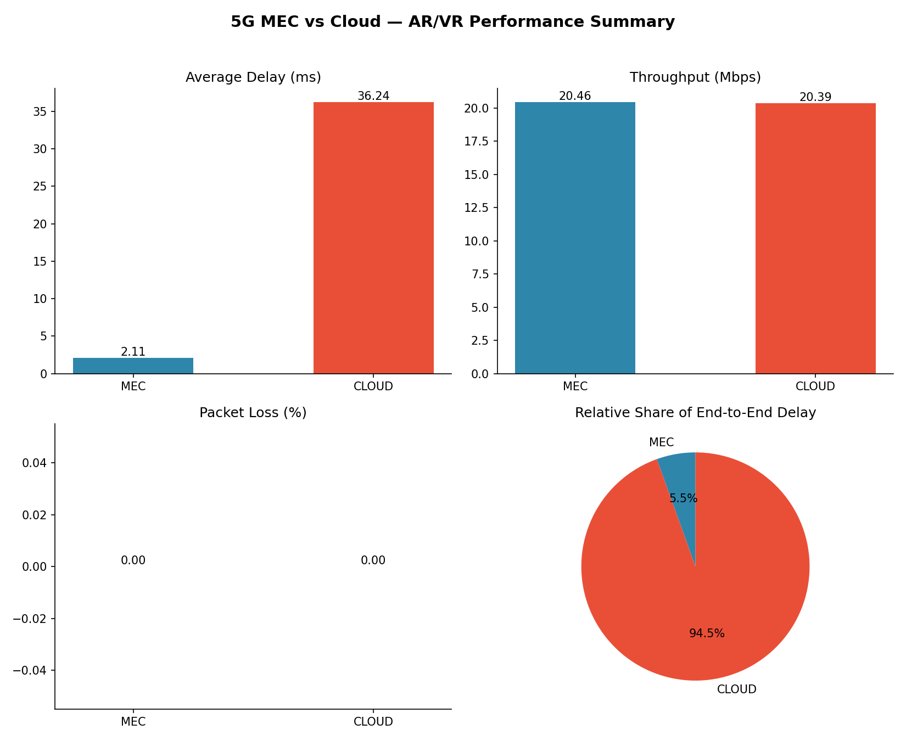

# 5G Edge Computing Smart City — MEC vs Cloud for AR/VR Traffic

A network simulation study comparing **Multi-access Edge Computing (MEC)** against
traditional **cloud offloading** for latency-sensitive AR/VR traffic in a 5G smart
city scenario, built with **ns-3**, validated independently in **Python** and
**MATLAB**, and visualized with **NetAnim**.

> Built as a project to demonstrate, with simulation evidence, how processing
> AR/VR traffic at the network edge (MEC) reduces end-to-end latency compared to
> routing the same traffic to a centralized cloud server.

---

## Table of Contents

- [Project Description](#project-description)
- [Objectives](#objectives)
- [Technologies Used](#technologies-used)
- [System Architecture](#system-architecture)
- [Workflow](#workflow)
- [Results](#results)
- [Screenshots](#screenshots)
- [How to Run](#how-to-run)
- [Repository Structure](#repository-structure)
- [Limitations & Future Work](#limitations--future-work)
- [Contributors](#contributors)

---

## Project Description

AR/VR applications (smart-city surveillance overlays, remote assistance, immersive
navigation, etc.) are extremely latency-sensitive — delays of even a few tens of
milliseconds are perceptible and degrade the experience. This project simulates a
single AR/VR user equipment (UE) connected to a 5G base station (gNB), with **two
parallel UDP traffic paths**:

- **MEC path**: UE → gNB → MEC server (co-located with the base station)
- **Cloud path**: UE → gNB → backhaul relay → distant cloud server

Both paths carry identical AR/VR-like traffic (constant-bitrate UDP, ~20 Mbps,
1200-byte payloads) so the comparison isolates the effect of **where the traffic is
processed**, not differences in traffic pattern.

The simulation is run in **ns-3**, instrumented with **FlowMonitor** for per-flow
delay/throughput/loss statistics and **NetAnim** for visual animation. Results are
then independently analyzed in **Python** (pandas + matplotlib) and **MATLAB**, so
the same conclusions are cross-validated by two separate toolchains.

## Objectives

- Model a realistic 5G MEC-vs-Cloud topology for AR/VR traffic using ns-3.
- Quantify end-to-end latency, throughput, and packet loss for both paths.
- Demonstrate the latency advantage of edge computing over centralized cloud
  processing for delay-sensitive smart-city applications.
- Cross-validate ns-3/FlowMonitor results using independent Python and MATLAB
  analysis pipelines.
- Visualize the network topology and packet flow using NetAnim.

## Technologies Used

| Tool | Purpose |
|---|---|
| **ns-3** (C++) | Network simulation — topology, traffic generation, FlowMonitor |
| **NetAnim** | Visual animation of the simulated topology and packet flow |
| **Python** (pandas, matplotlib) | Parses FlowMonitor output, generates comparison graphs |
| **MATLAB** | Independent statistical validation and graph regeneration |
| **FlowMonitor** | ns-3 module for per-flow delay/throughput/loss measurement |

## System Architecture

```
                         ┌───────────────────┐
                         │   AR/VR UE (User)  │
                         └─────────┬──────────┘
                                   │ 100 Mbps, 1 ms  (radio access link)
                                   ▼
                         ┌───────────────────┐
                         │  gNB (5G Base      │
                         │  Station)          │
                         └─────────┬──────────┘
                  ┌────────────────┴────────────────┐
                  │ 1 Gbps, 1 ms                     │ 500 Mbps, 20 ms
                  ▼ (co-located)                     ▼ (backhaul)
        ┌───────────────────┐               ┌───────────────────┐
        │    MEC Server      │               │  Backhaul Relay    │
        │   (edge compute)    │               └─────────┬──────────┘
        └───────────────────┘                            │ 500 Mbps, 15 ms
                                                            ▼
                                                 ┌───────────────────┐
                                                 │   Cloud Server      │
                                                 │ (centralized DC)    │
                                                 └───────────────────┘
```

Two independent UDP flows run concurrently from the same UE — one to the MEC
server, one to the cloud server — so FlowMonitor captures a fair, identical-traffic
comparison of both paths in a single simulation run.

## Workflow

```
ns-3 simulation (mec_arvr_final.cc)
        │
        ├── FlowMonitor  ──► flowmon.xml, results_summary.csv
        └── NetAnim      ──► mec_arvr_final.xml
        │
        ▼
Python analysis (analysis.py)
        │  reads results_summary.csv
        ▼
results/  (latency.csv, throughput.csv, comparison_table.csv,
           latency.png, throughput.png, packet_loss.png, comparison.png,
           summary.txt)
        │
        ▼
MATLAB validation (mec_analysis.m)
        │  reads results/latency.csv
        ▼
results/  (matlab_latency_comparison.png, matlab_throughput_comparison.png,
           matlab_packet_loss.png, matlab_delay_histogram.png,
           matlab_delay_cdf.png, matlab_summary.csv, matlab_stats_summary.txt)
```

## Results

Simulation: 1 AR/VR UE, 10-second simulation time, ~20 Mbps UDP traffic per path,
1200-byte packets, 18,750 packets transmitted on each path.

| Metric | MEC | Cloud | Improvement with MEC |
|---|---|---|---|
| Average end-to-end delay | **2.11 ms** | 36.24 ms | **94.2% lower latency** |
| Throughput | 20.46 Mbps | 20.39 Mbps | +0.38% |
| Packet loss | 0.00% | 0.00% | — |

These numbers come directly from `results/summary.txt` / `results/latency.csv`,
generated by `python/analysis.py` from the ns-3 FlowMonitor output, and are
independently reproduced by `matlab/mec_analysis.m`.

**Takeaway:** Processing AR/VR traffic at the network edge cuts end-to-end delay by
over 94% compared to routing it to a distant cloud server, with no throughput
penalty and no packet loss on either path in this scenario. This is the latency
benefit MEC is designed to deliver for delay-sensitive applications.

> Both paths share the same ~20 Mbps source rate and neither path drops packets in
> this run, so the headline result here is specifically about **latency**, not
> throughput or reliability — see [Limitations](#limitations--future-work) for what
> a fuller study would add.

## Screenshots

| | |
|---|---|
|  |  |
|  |  |

NetAnim animation and terminal output screenshots: see [`screenshots/`](screenshots/).

## How to Run

### Prerequisites
- ns-3 (developed against the `ns-3-dev` tree)
- Python 3.x with `pandas` and `matplotlib`
- MATLAB (Desktop or Online) — optional, for the validation step
- NetAnim — optional, to view the animation

### 1. Run the ns-3 simulation

```bash
# Copy the scenario into your ns-3 scratch folder
cp ns-3-dev/scratch/mec_arvr_final.cc <your-ns-3-dev>/scratch/

cd <your-ns-3-dev>
./ns3 run scratch/mec_arvr_final
```

This produces `flowmon.xml`, `mec_arvr_final.xml` (NetAnim), and
`results_summary.csv` in the ns-3 working directory.

Optional command-line overrides:
```bash
./ns3 run "scratch/mec_arvr_final --simTime=15 --dataRate=25Mbps --enablePcap=true"
```

### 2. Run the Python analysis

```bash
cd python
pip install pandas matplotlib
python3 analysis.py
```

This reads `results_summary.csv` from the ns-3 working directory and writes all
CSVs/PNGs into `results/`.

### 3. Run the MATLAB validation (optional)

Open `matlab/mec_analysis.m` in MATLAB and run it. The script automatically
locates the `results/` folder relative to its own location — no path editing
required, on MATLAB Desktop, MATLAB Online, Windows, or Linux.

### 4. View the NetAnim animation (optional)

```bash
cd results
unzip mec_arvr_final.xml.zip
netanim mec_arvr_final.xml
```

> **Note on file size:** the NetAnim trace is committed as `mec_arvr_final.xml.zip`
> (~2 MB) instead of the raw XML (~37 MB), since it logs packet-level animation
> data for the full 10-second run and compresses very well. Unzip it locally to
> view in NetAnim — you don't need to unzip it if you only want the numeric
> results and graphs.

## Repository Structure

```
5G-Edge-Computing-Smart-City/
│
├── README.md
├── LICENSE
├── .gitignore
│
├── ns-3-dev/
│   └── scratch/
│       └── mec_arvr_final.cc      # ns-3 simulation source
│
├── python/
│   └── analysis.py                # FlowMonitor CSV → graphs + tables
│
├── matlab/
│   └── mec_analysis.m             # Independent statistical validation
│
├── results/
│   ├── latency.csv / throughput.csv / comparison_table.csv / results_summary.csv
│   ├── latency.png / throughput.png / packet_loss.png / comparison.png
│   ├── flowmon.xml                # ns-3 FlowMonitor raw output
│   ├── mec_arvr_final.xml.zip     # NetAnim trace (zipped — ~37 MB raw)
│   ├── matlab_*.png / matlab_summary.csv / matlab_stats_summary.txt
│   └── summary.txt
│
├── screenshots/
│   └── (NetAnim, terminal output, graph screenshots)
│
└── docs/
    └── (project report / presentation, if included)
```

## Limitations & Future Work

This run simulates **one UE with one flow per path**, so the reported statistics
are single-sample (no variance, no confidence interval, no meaningful
histogram/CDF shape) — `matlab/mec_analysis.m` flags this explicitly in its
generated `matlab_stats_summary.txt`. Planned extensions:

- Simulate multiple UEs / multiple concurrent AR/VR flows per path to get a true
  distribution of delay and throughput.
- Repeat the simulation across multiple `RngRun` seeds and aggregate, enabling a
  proper statistical test (e.g. two-sample t-test) between MEC and Cloud delay.
- Introduce background traffic / network congestion to test MEC's advantage under
  load, not just on an otherwise idle link.
- Model mobility (UE handover between gNBs) rather than fixed node positions.
- Compare additional MEC placement strategies (e.g. multi-tier edge vs. single
  edge node).

## Contributors

- *Add your name(s) here*

---

*This repository accompanies a 5G Edge Computing Smart City (AR/VR MEC) project.
All results in `results/` were generated by actually running the included ns-3
simulation and analysis scripts — see [How to Run](#how-to-run) to reproduce them.*
